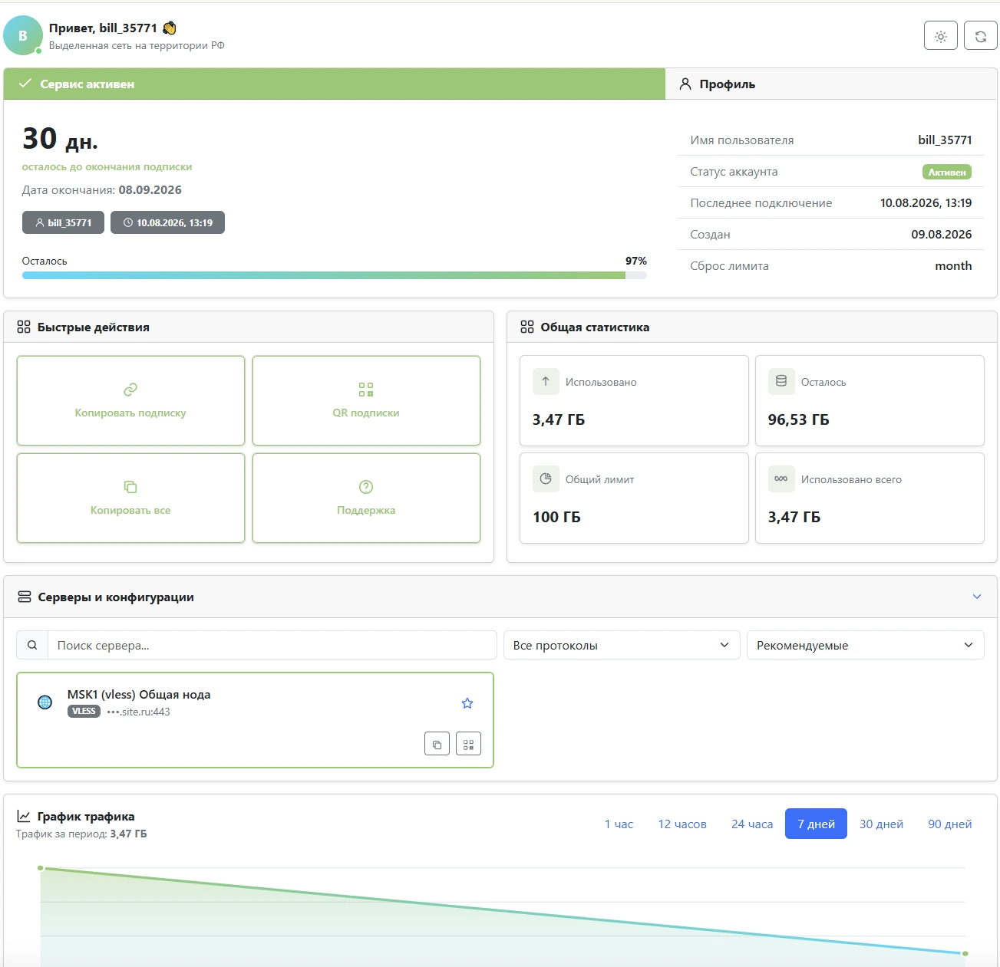

<p align="center">
  <a href="README.md">🇮🇷 فارسی</a> ·
  <a href="README.en.md">🇬🇧 English</a> ·
  <strong>🇷🇺 Русский</strong> ·
  <a href="README.zh.md">🇨🇳 中文</a>
</p>

# Неоновый шаблон PasarGuard

## Быстрая установка из GitHub

```bash
curl -fsSL https://raw.githubusercontent.com/7Berlin/pasarguard-neon-template/main/install.sh | sudo bash -s -- --activate
```

Команда устанавливает и активирует шаблон только с **персидским языком**.



## Команды установки

| Команда | Описание |
|---|---|
| `sudo bash install.sh --activate` | Установка с персидским языком по умолчанию |
| `sudo bash install.sh --activate -fa -en` | Персидский и английский; персидский по умолчанию |
| `sudo bash install.sh --activate -en -ru --default-lang en` | Английский и русский; английский по умолчанию |
| `sudo bash install.sh --activate -fa -en -ru -zh` | Установка всех языков |
| `sudo bash install.sh --activate --config ./template.conf` | Установка с пользовательской конфигурацией |

| Флаг | Язык |
|---|---|
| `-fa` | 🇮🇷 Персидский |
| `-en` | 🇬🇧 Английский |
| `-ru` | 🇷🇺 Русский |
| `-zh` | 🇨🇳 Китайский |

## Настройка шаблона

Измените `template.conf` и повторно запустите установку:

```bash
git clone https://github.com/7Berlin/pasarguard-neon-template.git
cd pasarguard-neon-template
nano template.conf
sudo bash install.sh --activate --config ./template.conf
```

| Параметр | Назначение |
|---|---|
| `BRAND_NAME` | Название сервиса |
| `BRAND_SUBTITLE` | Текст под именем пользователя |
| `AVATAR_URL` | URL изображения профиля или логотипа |
| `AVATAR_FILE` | Локальный PNG, JPG, WEBP, GIF или SVG |
| `PRIMARY_COLOR` | Основной цвет |
| `SECONDARY_COLOR` | Второй цвет |
| `CYAN_COLOR` | Акцентный цвет |
| `DEFAULT_THEME` | Тема `dark` или `light` |
| `SUPPORT_URL` | Ссылка на инструкцию или поддержку |
| `PANEL_DOMAIN` | Домен панели при необходимости |

Поддержите проект звездой на GitHub ⭐
